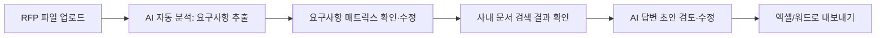
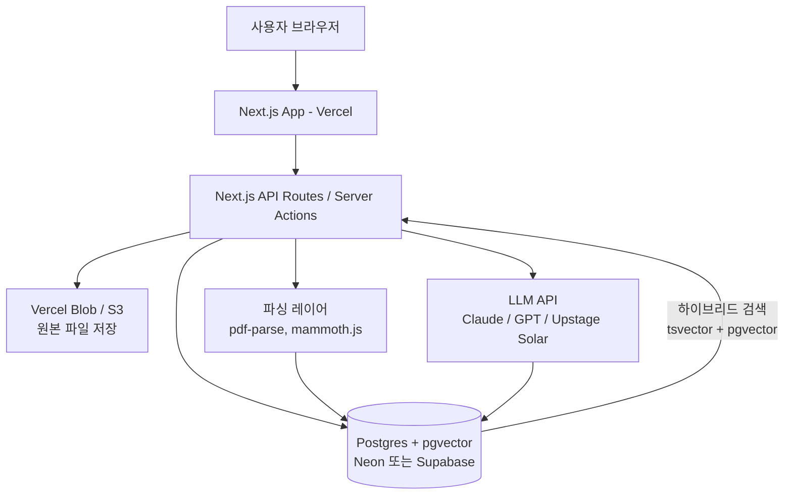

# AI 기반 RFP·제안서 작성 지원 플랫폼 — 솔로 개발자용 실행계획

> **전제 조건**: 개발은 1인이 진행합니다. 이 문서는 원본 기획서의 23개 항목을 모두 다루되, "혼자서 3~6개월 안에 실제로 만들 수 있는가"를 최우선 기준으로 범위를 재조정했습니다. 원본 기획서 수준(완전한 워크플로우 엔진, 온프레미스, 공공인증, 다중 파일형식, 팀 협업 전체 기능)은 **혼자서는 사실상 불가능**하므로, 그 이유와 대안을 먼저 명확히 짚고 시작합니다.

Loopio 홈페이지를 확인한 결과, Loopio는 콘텐츠 라이브러리 기반 답변 추천(Confident Answers), 질문 임포트·자동 채움(Effortless Projects), SME 배정·알림·Slack/Teams 연동(Seamless Collaboration), 프로젝트 분석(Strategic Insights) 4대 축으로 구성되어 있고, SOC2/AWS 호스팅에 80개 이상의 소스 연동을 강점으로 내세웁니다. 즉 Loopio는 **"이미 방대한 콘텐츠 라이브러리와 협업 인프라를 갖춘 대기업"**을 위한 도구입니다. 혼자 개발하는 우리는 이 방향을 그대로 좇으면 안 되고, Loopio가 시간이 지나야 도달하는 "협업·통합·분석" 대신 **"요구사항 추출 + 근거 있는 답변 추천"이라는 가장 뾰족한 한 가지 문제**만 파고드는 것이 현실적입니다.

---

## 1. 사업 아이디어에 대한 종합 평가

| 항목 | 평가 |
|---|---|
| 문제의 실재성 | 높음. RFP 요구사항 파악과 과거 자료 재사용은 실제로 반복적 시간 낭비를 유발하는 검증된 문제 (Loopio 등 해외 시장 존재가 방증) |
| 시장 검증 | Loopio가 1,700개 이상 기업에서 사용 중이라는 점에서 카테고리 자체는 검증됨. 다만 국내에는 이 카테고리의 지배적 강자가 없음 |
| 한국 시장 진입 여지 | HWP/HWPX, 국내 공공/금융 보안규제, 낮은 가격 민감도의 중소 SI 시장은 해외 솔루션이 손대기 어려운 틈새 |
| 솔로 개발 난이도 | **원본 기획서 그대로는 3~5인 팀이 1년 이상 걸리는 규모**. 혼자 하려면 기능의 80% 이상을 MVP 이후로 미뤄야 함 |
| 결론 | "RFP 요구사항 자동 추출 + 사내 문서 검색·답변 추천"이라는 단일 기능으로 좁히면 혼자서도 3개월 내 검증 가능한 제품을 만들 수 있음. 나머지(워크플로우, 협업, 온프레미스, 공공인증)는 유료 고객이 실제로 요구할 때 순차적으로 추가 |

---

## 2. 핵심 고객과 가장 중요한 문제

**1인 개발 초기 단계에서 가장 적합한 타깃**: 직원 20~100명 규모의 IT 솔루션·SI 기업의 **프리세일즈/제안 담당자 1~3인**. 이유는 다음과 같습니다.

- 의사결정 구조가 단순해서 담당자 본인이 카드로 결제 가능한 가격대면 바로 도입 결정 가능
- RFP·제안서 작성 빈도가 높아 pain이 크고, 반대로 예산은 크지 않아 대형 벤더(Loopio 등)를 도입하지 못하고 있음
- 대기업/공공기관은 보안심사·구매 프로세스가 길어 솔로 개발 초기에는 영업 사이클을 감당하기 어려움

**가장 중요한 단일 문제(wedge)**: "RFP를 열어서 요구사항을 표로 정리하고, 과거에 비슷한 답변을 쓴 적이 있는지 찾는 데 하루 이상 걸린다." 이 하나만 3배 빠르게 해결해도 유료 전환이 가능합니다. 워크플로우/승인/협업은 이 wedge가 검증된 이후의 문제입니다.

| 사용자 유형 | MVP에서의 취급 |
|---|---|
| 영업 담당자 | 주 사용자 (1차 타깃) |
| 프리세일즈/제안 PM | 주 사용자 (1차 타깃) |
| 기술 담당자 | 2단계에서 "담당자 배정" 기능으로 지원 |
| 보안·법무 담당자 | 3단계 이전에는 미지원. 승인 워크플로우 없이 텍스트 경고만 표시 |
| 경영진/최종 승인자 | 3단계 이후 대시보드로 지원 |

---

## 3. 제안하는 핵심 제품 포지셔닝

> **"업로드하면 30분 안에 요구사항 매트릭스와 근거 있는 답변 초안이 나오는, 한국 기업을 위한 RFP 분석 코파일럿"**

- Loopio처럼 "전사 콘텐츠 플랫폼"이 아니라 **"RFP 한 건을 빠르게 분석하는 도구"**로 좁게 포지셔닝
- 차별화 축: ① HWP/HWPX 지원(2단계 목표, 국내 유일 강점) ② 국내 리전 데이터 보관 및 한국어 특화 추출 정확도 ③ Loopio 대비 1/10 수준 가격 ④ 설치·연동 없이 웹 업로드만으로 즉시 사용(온보딩 마찰 최소화)
- 명시적으로 하지 않을 것: 완전 자동 제안서 작성, 다부서 승인 워크플로우, 대형 CRM/그룹웨어 연동 — 이건 "우리가 아직 안 한다"가 아니라 "당분간 의도적으로 안 한다"

---

## 4. 사용자별 업무 흐름 (MVP 기준 단순화)

MVP에서는 역할·권한 시스템을 만들지 않고, **한 회사당 계정 1~5개가 문서를 공유하는 단순 구조**로 시작합니다 (Organization 개념은 있지만 Role은 Owner/Member 2단계만).



담당자별 업무 분리, 댓글, 승인 체인은 2~3단계 항목으로 미룹니다(아래 6번 참조).

---

## 5. 전체 기능 목록 (MVP / 2단계 / 3단계)

| 기능 | MVP | 2단계 | 3단계 |
|---|:---:|:---:|:---:|
| PDF/DOCX 업로드·파싱 | ✅ | | |
| HWP/HWPX 파싱 | | ✅ | |
| 스캔 PDF OCR | | ✅ | |
| 요구사항 자동 추출(매트릭스) | ✅ | | |
| 필수/선택/권고 구분 | ✅ | | |
| 사내 문서(과거 제안서) 업로드·검색 | ✅ | | |
| 하이브리드(키워드+벡터) 검색 | ✅ | | |
| 검색결과 리랭킹 | | ✅ | |
| 근거 기반 답변 초안 생성 | ✅ | | |
| 출처·인용 위치 표시 | ✅ | | |
| 답변 신뢰도 라벨(근거충분/부분근거/확인필요) | ✅ | | |
| 요구사항별 상태·담당자 관리 | | ✅ | |
| 댓글·멘션·승인 워크플로우 | | ✅ | |
| 엑셀/워드 내보내기(신규 양식) | ✅ | | |
| 원본 RFP 양식 그대로 유지한 내보내기 | | | ✅ |
| 대시보드·진행률·알림 | | ✅ | |
| RBAC·세밀한 문서 접근권한 | | ✅ | |
| 조직 간 완전한 테넌트 격리(RLS) | ✅(기본) | ✅(고도화) | |
| SSO, 그룹웨어/CRM 연동 | | | ✅ |
| 온프레미스/프라이빗 클라우드 | | | ✅ |
| ISMS-P/CSAP 대응 | | | ✅ |
| 파인튜닝 모델 | | | (도입하지 않음, 아래 12번 참조) |

---

## 6. MVP 기능과 제외 기능 (가장 중요한 결정)

### MVP에 반드시 포함

1. **파일 업로드**: PDF, DOCX만 (HWP 제외 — 이유는 아래)
2. **RFP 요구사항 자동 추출**: LLM API 호출로 요구사항 ID/원문/유형/중요도/마감일 추출 → 편집 가능한 표
3. **사내 문서 라이브러리**: 과거 제안서 PDF/DOCX 업로드 → 자동 청킹·임베딩
4. **하이브리드 검색**: Postgres 전문검색 + pgvector 유사도 검색 결합 (별도 검색엔진 없이 단일 DB로 처리)
5. **근거 기반 답변 추천**: 요구사항별 Top-3 관련 문서 스니펫 + 출처(문서명, 페이지) + AI 답변 초안
6. **신뢰도 라벨링**: "근거충분/부분근거/확인필요/근거없음" 4단계 자동 태깅, 근거 없는 항목은 절대 임의 생성 금지
7. **간단한 내보내기**: 요구사항 매트릭스 + 답변을 XLSX/DOCX(새 양식)로 다운로드

### MVP에서 과감히 제외 (이유 명시)

| 제외 기능 | 제외 이유 |
|---|---|
| HWP/HWPX 파싱 | 공식 API가 유료·제한적이고 서드파티 라이브러리(hwp.js, pyhwp 등)는 최신 HWPX 서식·표·이미지 처리가 불안정. 혼자서 안정적으로 구현하려면 수 주가 소요됨. **MVP는 "PDF/DOCX로 변환 후 업로드"를 안내 문구로 우회** |
| 스캔 PDF OCR | 정확도 확보와 예외처리 비용이 큼. Naver Clova OCR, Google Document AI 등 외부 API를 나중에 얇게 붙이는 방식으로 2단계에 배치 |
| 승인 워크플로우/댓글/멘션 | 다중 사용자 협업 로직(권한, 알림, 상태머신)은 혼자 만들기엔 개발 공수가 크고, 1인 사용자 검증 단계에서는 불필요 |
| 원본 RFP 양식 그대로 유지한 출력 | DOCX/HWP 원본의 표·스타일·목차 완전 보존은 기술적으로 매우 까다로움(아래 7·11번). MVP는 "새 표준 양식"으로만 출력 |
| 그룹웨어/CRM 연동 | 초기 고객이 없는 상태에서 연동 대상도 불확실. 검증 후 고객이 원하는 시스템 1개만 우선 연동 |
| 온프레미스/프라이빗 구축 | 인프라 운영 부담이 큼. SaaS 단일 버전으로 시작 |
| 파인튜닝 | 데이터도, 인력도, ROI도 없음. RAG로 충분 (12번 참조) |

---

## 7. 화면 및 UX 구조

```
[대시보드] — RFP 프로젝트 목록(카드형), + 새 RFP 추가
   └─ [RFP 상세 페이지]
        ├─ 탭1. 업로드 — RFP 원문 + 첨부파일 드래그앤드롭
        ├─ 탭2. 요구사항 매트릭스 — 표(ID/원문/유형/중요도/상태), 행 클릭 시 우측 패널 오픈
        │      └─ 우측 패널: 추천 답변 3개 카드(출처·신뢰도 라벨 포함) → "이 답변 사용" → 텍스트 편집기
        ├─ 탭3. 내보내기 — 매트릭스 전체를 XLSX/DOCX로 다운로드
[문서 라이브러리] — 과거 제안서/회사소개서 업로드, 파일별 상태(임베딩 완료 여부) 표시
[설정] — API 사용량, 조직 멤버(2인 이상일 때)
```

**클릭 흐름 예시**: 사용자가 RFP PDF를 드래그앤드롭 → "분석 시작" 클릭 → 30초~2분 후 요구사항 매트릭스 자동 생성 → 특정 행(예: "ISO 27001 인증 보유 여부") 클릭 → 우측 패널에 사내 문서에서 찾은 관련 스니펫 3개와 신뢰도 라벨 표시 → "이 내용으로 답변 채우기" 클릭 → 답변 텍스트가 편집 가능한 상태로 삽입 → 사용자가 직접 수정 후 저장.

---

## 8. RFP 분석 결과 예시

가상의 공공 SI 사업 RFP에서 추출한 예시입니다.

| 항목 | 값 |
|---|---|
| 원문 발췌 | "제안사는 최근 3년 이내 유사 사업(공공기관 대상 업무시스템 구축) 수행 실적을 2건 이상 보유해야 한다" |
| 요구사항 유형 | 자격요건 |
| 중요도 | 필수 |
| 추출 근거 위치 | RFP.pdf, 4페이지, "입찰참가자격" 항목 |
| AI 판단 | 자격요건 미충족 시 참가 자체가 불가하므로 최우선 확인 필요 |

---

## 9. 요구사항 매트릭스 예시

| ID | 요구사항 원문(요약) | 유형 | 중요도 | 관련 자료 | 답변 상태 | 확인 필요사항 |
|---|---|---|---|---|---|---|
| REQ-001 | 유사사업 수행실적 3년 내 2건 이상 | 자격요건 | 필수 | 과거 실적증명서 2건 매칭 | 답변완료 | - |
| REQ-002 | 개인정보 암호화 저장 방식 기술 | 보안 | 필수 | 2023년 제안서 스니펫(부분 일치) | 부분근거 | 최신 암호화 정책 반영 여부 확인 |
| REQ-003 | 장애 발생 시 4시간 내 복구 SLA | 운영 | 권고 | 검색결과 없음 | 근거없음 | 운영팀 직접 확인 필요 |
| REQ-004 | 제안서 분량 40페이지 이내 | 제출형식 | 필수 | 해당없음 | 확인완료 | - |

---

## 10. 답변 추천 및 출처 표시 예시

| 요구사항 | 추천 답변(요약) | 근거 문서 | 근거 위치 | 신뢰도 | 검토 필요사항 |
|---|---|---|---|---|---|
| REQ-002 개인정보 암호화 | "저장 데이터는 AES-256, 전송 구간은 TLS 1.2 이상을 적용합니다" | 2023_A사_제안서.docx | 12페이지 3문단 | 부분근거 | 2023년 이후 정책 변경 여부를 보안 담당자가 재확인 |

- **부분근거로 표시하는 이유**: 원문이 "AES-128"로 되어 있어 최신 표준(AES-256)과 다를 수 있음을 AI가 자동 감지 → 사람이 확정 전 검토하도록 유도
- 근거가 전혀 없는 항목(REQ-003)은 답변을 생성하지 않고 "확인 필요" 배지만 표시

---

## 11. 전체 시스템 아키텍처 (솔로 개발자용 최소 구성)

원본 기획서의 아키텍처(별도 검색엔진, 별도 벡터DB, 워크플로우 엔진, OCR 서버 등)는 혼자 운영하기엔 구성요소가 너무 많습니다. **하나의 Postgres로 트랜잭션 데이터 + 벡터 검색 + 전문검색을 모두 처리**하는 것이 솔로 개발의 핵심 전략입니다.



- **왜 별도 검색엔진(Elasticsearch 등)을 쓰지 않는가**: 초기 데이터 규모(고객사당 문서 수백 건)에서는 Postgres의 `tsvector`(키워드) + `pgvector`(의미검색)만으로 충분한 성능이 나오며, 운영해야 할 서버가 1개(DB)로 줄어듭니다. 데이터가 수십만 건 이상으로 늘어나면 그때 전용 벡터DB(Pinecone, Qdrant 등) 이전을 검토합니다.
- **왜 워크플로우 엔진을 쓰지 않는가**: MVP는 상태값 컬럼(예: `status: draft | reviewed | final`) 하나로 충분합니다. Temporal 같은 워크플로우 엔진은 3단계 이후, 실제 승인 체인 요구가 나올 때 도입합니다.

---

## 12. RAG 및 검색 설계

| 항목 | MVP 설계 |
|---|---|
| 청킹 전략 | 표는 마크다운 표 형식으로 변환 후 별도 청크로 보존, 본문은 500~800 토큰 단위 + 100토큰 오버랩. 문단·페이지 번호를 메타데이터로 유지 |
| 한국어 임베딩 모델 | 1차 후보: OpenAI `text-embedding-3-large`(다국어 성능 안정적), 국내 대안으로 Upstage Solar Embedding(한국어 특화, 국내 리전 이슈에 유리) 비교 검토. 초기엔 API형으로 시작해 자체 호스팅 임베딩 모델(BGE-M3 등)은 비용 부담이 커질 때 전환 |
| 키워드+벡터 결합 | Postgres 안에서 `tsvector` 점수와 `pgvector` 코사인 유사도를 가중합(예: 0.4 : 0.6)으로 결합한 단일 SQL 쿼리로 처리 |
| 리랭킹 | MVP는 생략(비용·지연 증가). 2단계에서 LLM 기반 경량 리랭킹(상위 20개 → 5개로 압축) 도입 |
| 출처 인용 | 청크 저장 시 (문서ID, 페이지, 문단 순번)을 함께 저장 → 답변 생성 시 LLM에 "반드시 제공된 청크 안에서만 답하고, 각 문장에 출처 ID를 표기하라"는 구조화된 프롬프트 사용 |
| 신뢰도 계산 | 검색 유사도 점수 + LLM 자체 확신도 자기평가(structured output)를 조합해 4단계 라벨 산출. 완벽하지 않지만 "과신 방지" 목적으로는 충분 |
| 권한 필터링 | MVP는 조직 단위로만 필터(Row Level Security). 문서별 세밀 권한은 2단계 |
| 상충 내용 처리 | 동일 요구사항에 대해 서로 다른 근거가 상충되면 두 근거를 모두 보여주고 "상충 발견"만 표시, 자동 판단은 하지 않음 |

**RAG vs 파인튜닝**: 초기에는 **RAG만 사용**합니다. 이유: ① 학습 데이터(질문-정답 쌍) 자체가 없음 ② 회사마다 지식이 계속 바뀌는데 파인튜닝은 갱신 비용이 큼 ③ 근거 추적(출처 표시)이 파인튜닝보다 RAG에서 훨씬 쉬움 ④ 혼자 GPU 인프라를 운영/관리할 여력이 없음. 파인튜닝은 데이터가 수천 건 쌓이고, 특정 도메인 패턴이 명확해졌을 때만 재검토합니다.

---

## 13. LLM 선택 (2026년 7월 기준 가정, 가격·모델은 변동 가능)

| 구분 | 예시 | 한국어 이해도 | 보안(제로 리텐션) | 비용 | 솔로 개발 적합성 |
|---|---|---|---|---|---|
| 상용 API | Claude, GPT 계열 | 높음 | 엔터프라이즈 계약 시 학습 미사용 옵션 제공 | 사용량 기반, 예측 어려움 | **가장 적합** — 인프라 운영 부담 없음 |
| 국내 모델 API | Upstage Solar 등 | 한국어 특화 강점 | 국내 리전 처리 가능성(영업 시 마케팅 포인트) | 상용 API와 유사 | 보조 옵션, 국내 데이터 규제 민감 고객 대상 |
| 오픈소스 자체 호스팅 | Llama 계열 등 | 모델별 편차 큼 | 완전 통제 가능하나 운영 부담 큼 | GPU 인프라 고정비 발생 | **비추천** — 혼자서 안정적 운영 어려움 |
| 프라이빗 구축 | 온프레미스 배포 | - | 최고 수준 | 매우 높음 | 3단계 이후, 실제 대기업/공공 고객 요구 시에만 |

**솔로 개발 결론**: 상용 API(Claude/GPT 등)를 기본으로 하되, 계약 시 "고객 데이터를 모델 학습에 사용하지 않음"을 확인하고 이를 서비스 이용약관과 영업자료에 명시하는 것으로 보안 신뢰를 확보합니다. 자체 모델 호스팅은 검토 대상에서 제외합니다.

---

## 14. 주요 데이터 모델 (MVP 간소화 버전)

| 엔티티 | 핵심 필드 | 관계 |
|---|---|---|
| Organization | id, name, plan | User 1:N |
| User | id, org_id, email, role(owner/member) | Organization N:1 |
| Project | id, org_id, name, due_date, status | RFPDocument 1:N |
| Document | id, org_id, project_id(nullable), type(rfp/knowledge), file_url, parsed_status | DocumentChunk 1:N |
| DocumentChunk | id, document_id, content, embedding(vector), page, section, tsv | Document N:1 |
| Requirement | id, project_id, source_text, type, priority, status, assignee(nullable) | Response 1:1 |
| Response | id, requirement_id, draft_text, confidence_label | Citation 1:N |
| Citation | id, response_id, chunk_id, score | DocumentChunk N:1 |
| AuditLog | id, org_id, actor_id, action, target, created_at | - |

Role, Approval, Comment, Task, Evaluation 엔티티는 2~3단계에서 실제 협업 요구가 확인된 뒤 추가합니다. 처음부터 만들면 스키마 마이그레이션 부담만 커집니다.

---

## 15. 보안 및 컴플라이언스 (솔로 개발자가 실제로 할 수 있는 범위)

> 아래는 일반적인 기술적 조치 설명이며, 법률 자문이나 인증 심사 결과를 대체하지 않습니다. 개인정보보호법·ISMS-P·CSAP 관련 최종 판단은 반드시 전문 법무·보안 컨설팅을 통해 확인하시기 바랍니다.

| 항목 | MVP에서 현실적으로 할 수 있는 조치 |
|---|---|
| 저장/전송 암호화 | Neon/Vercel 기본 제공 TLS + 저장 시 암호화(클라우드 제공사 기본 기능) 활용 — 별도 구현 불필요 |
| 테넌트 데이터 격리 | Postgres Row Level Security(RLS)로 org_id 기준 격리. 별도 DB 분리는 3단계(엔터프라이즈 계약) 이후 |
| LLM 데이터 학습 사용 금지 | API 벤더의 비즈니스/엔터프라이즈 약관에서 옵트아웃 옵션 확인 후 계약서에 명시 |
| 개인정보 탐지·마스킹 | MVP는 자동 마스킹 대신 "이 문서에 개인정보로 추정되는 내용이 포함되어 있습니다" 경고만 표시(정규식 기반 간단 탐지: 주민번호, 전화번호 패턴). 정교한 비식별화는 2단계 |
| 감사 로그 | 주요 액션(업로드, 다운로드, 삭제)만 최소 로깅 |
| 프롬프트 인젝션 대응 | 업로드 문서 내용은 "데이터"로만 취급하고 시스템 지시와 명확히 분리하는 프롬프트 구조 사용, 문서 내 지시문이 시스템 동작을 바꾸지 못하도록 함 |
| 악성 파일 업로드 대응 | 파일 확장자·MIME 타입 검증, 파싱 전 사이즈 제한, 서버리스 함수 격리 실행 |
| ISMS-P / CSAP | MVP·2단계에서는 대응하지 않음. 공공/대기업 고객이 실제로 요구할 때(3단계) 별도 예산과 기간(보통 6개월 이상)을 잡고 전문 컨설팅과 함께 진행 |

---

## 16. 기술 스택 제안

| 영역 | 추천 | 이유 |
|---|---|---|
| 프론트엔드 | Next.js + shadcn/ui | 빠른 개발 속도, 이미 익숙한 스택 재사용 |
| 백엔드 | Next.js Server Actions/API Routes | 별도 백엔드 서버 없이 하나의 배포 단위로 운영 |
| ORM/DB | Drizzle ORM + Postgres(Neon, pgvector 확장) | 벡터+관계형 데이터를 한 DB에서 처리, 운영 부담 최소화 |
| 파일 저장소 | Vercel Blob 또는 S3 | 별도 스토리지 서버 불필요 |
| 문서 파싱 | `pdf-parse`/`unpdf`(PDF), `mammoth`(DOCX) | Node 생태계 내에서 서버리스 함수로 처리 가능 |
| LLM | Claude API(또는 GPT 계열) | 13번 참조 |
| 인증 | Auth.js 또는 Clerk | SSO는 2단계 이후 |
| 배포/인프라 | Vercel | 서버 관리 불필요, 기존 배포 경험 재사용 |
| 모니터링 | Vercel Analytics + Sentry(무료 티어) | 최소 비용으로 오류 추적 |

**개발방식 비교**: "자체 개발"이 유일한 현실적 선택입니다. 기존 지식관리 솔루션 조합은 커스터마이징 한계가 있고, 오픈소스 모델 기반 프라이빗 구축은 혼자 운영하기엔 인프라 부담이 너무 큽니다. 상용 LLM API를 얇게 감싸는 자체 개발이 가장 빠르고 통제 가능한 경로입니다.

---

## 17. 개발 로드맵 (1인 기준)

| 단계 | 기간(누적) | 목표 | 주요 산출물 |
|---|---|---|---|
| MVP | 0~3개월 | 단일 wedge 기능 검증, 파일럿 고객 1~2곳 확보 | 업로드→추출→검색→답변추천→엑셀 내보내기 |
| 2단계 | 3~7개월 | 유료 전환 고객 5~10곳 대응, HWP 지원 | HWP/HWPX 파싱, 담당자 배정, 리랭킹, 간단 대시보드 |
| 3단계 | 7~14개월 | 중견기업/공공 확장 준비 | 승인 워크플로우, 세밀 권한, 원본양식 유지 출력, 보안 인증 대응 착수 |

**선행조건**: MVP 단계에서는 개발 외에도 파일럿 고객 확보(주변 업계 네트워크 활용)를 병행해야 하며, 실제 RFP·과거 제안서 샘플 데이터 없이는 정확도 검증이 불가능하므로 최소 1개 협력 기업의 실데이터 확보가 사실상 선행조건입니다.

---

## 18. 개발 인력 및 비용

개발 인력은 본인 1인이므로 인건비 대신 **인프라·API 비용**과 **기회비용(본업 병행 시 소요 시간)**을 기준으로 추정합니다.

| 시나리오 | 월간 인프라+API 비용(추정) | 전제 |
|---|---|---|
| 최소(개발·테스트 단계) | 5~15만 원 | Vercel/Neon 무료~하위 유료 티어, LLM API 소량 테스트 호출 |
| 현실적(파일럿 고객 1~5곳) | 30~80만 원 | Vercel Pro, Neon 유료 플랜, 월 수백~수천 건 LLM 호출(문서당 수십 페이지 기준) |
| 확장(유료 고객 10곳 이상) | 150~400만 원 이상 | DB 용량 증가, LLM 호출량 증가, 스토리지 비용 증가, 2단계 OCR API 비용 추가 |

LLM API 비용은 문서 길이와 요구사항 개수에 따라 편차가 크므로, MVP 출시 전 실제 RFP 샘플로 1건당 비용을 반드시 실측해 가격 정책(19번)에 반영해야 합니다.

---

## 19. 검증 및 품질평가 방법 (솔로 개발 현실판)

- 정교한 정량 파이프라인 대신, **본인이 보유했거나 파일럿 고객에게 받은 과거 RFP 3~5건 + 실제 제출된 제안서**를 테스트셋으로 삼아 수작업 비교
- 평가 방법: AI가 추출한 요구사항 매트릭스를 사람이 직접 만든 매트릭스와 비교해 누락률·오탐률 확인, 추천 답변을 실제 채택 여부로 채점
- 초기엔 아래 지표만 최소 추적: ① 요구사항 추출 누락률 ② 답변 채택률(수정 없이 사용/일부 수정/전면 재작성) ③ 문서 1건당 처리 시간
- Top-K 검색 정확도, F1 점수 등 정교한 지표는 사용자 수가 늘어나 자동화된 평가가 필요해지는 2단계 이후에 도입

---

## 20. 시장진입 및 가격전략

- **초기 파일럿**: 무료 또는 매우 저가로 1~2개 기업에 제공하고 실제 사용 데이터·피드백 확보에 집중 (매출보다 검증이 우선)
- **가격 구조 제안**: 사용자 수보다는 **월간 처리 RFP 건수 기반 과금**이 솔로 개발 초기엔 관리하기 쉬움 (예: RFP 10건/월 포함 요금제 → 초과 시 건당 과금). 사용량 기반이 비용(LLM API)과 직접 연동되어 예측 가능
- **Loopio 대비 차별화 포인트**: 가격(1/10 수준), HWP 지원, 국내 데이터 처리, 설치 없는 즉시 사용
- **영업 전략**: 초기엔 개인 네트워크 기반 파일럿 → 성공 사례(수주율 개선, 시간 절감) 확보 후 콘텐츠 마케팅(블로그, 커뮤니티)으로 확장. 별도 영업조직 없이 셀프서비스 가입 + 데모 요청 방식이 솔로 운영에 적합

---

## 21. 핵심 리스크

| 리스크 | 발생 가능성 | 영향도 | 조기 경고 신호 | 대응방안 |
|---|---|---|---|---|
| 혼자 개발하다 범위가 계속 확장(스코프 크립) | 높음 | 높음 | MVP 출시 전에 신규 기능 아이디어가 계속 늘어남 | 6번의 "제외 기능" 목록을 문서로 고정하고, 신규 아이디어는 백로그로만 기록 |
| RFP/HWP 파싱 정확도 부족 | 높음 | 중간 | 특정 서식에서 표·목차가 깨짐 | MVP는 PDF/DOCX로 범위 축소, 실패 시 원문 링크 병기해 사람이 확인하도록 fallback |
| LLM 환각(근거 없는 답변 생성) | 중간 | 높음 | 사용자가 답변을 신뢰했다가 오류 발견 | "근거 없음" 라벨을 강제하는 프롬프트 구조 + 근거 청크 없이는 답변 생성 자체를 차단 |
| 초기 고객 확보 실패 | 중간 | 높음 | 파일럿 요청에도 응답이 없음 | 무료 파일럿으로 진입장벽 최소화, 개인 네트워크부터 시작 |
| LLM API 비용 과다 | 중간 | 중간 | 문서 1건당 비용이 예상보다 높음 | 청킹·캐싱 최적화, 요금제에 사용량 상한 설정 |
| 혼자 운영 중 장애/보안 사고 대응 지연 | 낮음~중간 | 높음 | - | 관리형 서비스(Vercel, Neon) 위주로 구성해 인프라 장애 대응 부담을 벤더에 위임 |

---

## 22. 최종 추천안

1. **원본 기획서의 전체 범위를 목표로 삼지 말 것.** 그 기획서는 이미 검증된 팀이 시리즈 A 이후 만드는 제품 사양에 가깝습니다.
2. **"RFP 요구사항 추출 + 근거 기반 답변 추천" 단 하나의 wedge**로 3개월 안에 사용 가능한 MVP를 만드세요.
3. 기술적으로는 **Postgres 하나(pgvector+전문검색)** 로 벡터DB·검색엔진·워크플로우 엔진을 대체해 운영 구성요소를 최소화하세요.
4. HWP, OCR, 워크플로우, 온프레미스, 보안인증은 **실제 유료 고객이 요구할 때만** 순서대로 추가하세요.
5. 파일럿 고객 1~2곳을 개발과 동시에 확보하는 것이 기능 개발 자체보다 중요합니다.

---

## 23. 향후 2주간 실행계획

| 일정 | 할 일 |
|---|---|
| 1주차 초반 | 실제 과거 RFP 1~2건 + 관련 과거 제안서 확보(본인 자료 또는 지인 네트워크). 이 데이터 없이는 이후 모든 개발이 추측 기반이 됨 |
| 1주차 중반 | Next.js + Drizzle + Neon(pgvector) 기본 골격 세팅, PDF/DOCX 파싱 스파이크(가장 리스크 큰 부분을 가장 먼저 검증) |
| 1주차 후반 | 확보한 RFP 샘플로 "요구사항 추출" 프롬프트를 LLM API에 직접 테스트 → 실제 정확도와 건당 비용을 먼저 눈으로 확인 |
| 2주차 초반 | 요구사항 매트릭스 DB 스키마·화면 구현, 과거 제안서 업로드→임베딩 파이프라인 구현 |
| 2주차 중반 | 하이브리드 검색 + 답변 추천 + 출처 표시 붙이기 |
| 2주차 후반 | 매트릭스 엑셀 내보내기까지 연결해 "업로드→매트릭스→답변→다운로드" 엔드투엔드 1회 완주. 이 시점에 파일럿 후보에게 데모 요청 |

---

## 24. 의사결정이 필요한 질문 목록

1. 본업(HandySoft 업무)과 병행하시는지, 아니면 이 프로젝트에 전업으로 집중 가능한 시간이 확보되어 있는지 — 로드맵 기간(17번)이 이에 따라 크게 달라집니다.
2. 파일럿 고객으로 접근 가능한 실제 기업(과거 협업했던 SI·솔루션사 등)이 있는지 — 없다면 1주차 데이터 확보 계획부터 다시 세워야 합니다.
3. LLM API는 어떤 벤더로 시작할지(Claude/GPT/국내 모델) — 초기 비용 실측(18번)에 직접 영향을 줍니다.
4. HWP 지원을 2단계로 미루는 것에 동의하는지, 아니면 국내 시장 특성상 MVP부터 필수라고 판단하는지 — 이 결정에 따라 MVP 기간이 1개월 이상 늘어날 수 있습니다.
5. 가격을 사용량 기반(RFP 건수)으로 할지, 좌석 수 기반으로 할지 — 초기 타깃 고객사 규모(20~100명)를 감안할 때 사용량 기반을 권장하지만 최종 확인이 필요합니다.
